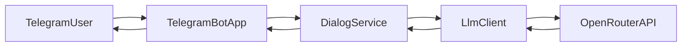

# Техническое видение (MVP)

Краткий технический контур Telegram-бота с ответами LLM по **роли технического специалиста** (состояние оборудования, нормативная база, вибродиагностика), задаваемой **системным промптом**. Цель — **минимально проверить идею** без инфраструктурного оверхеда: экспертиза модели опирается на **текст, который пользователь привносит в диалог** (описания, таблицы, выдержки из документов и ГОСТов, результаты измерений), а не на отдельную прикладную БД документов.

---

## 1. Технологии

| Область | Выбор |
|--------|--------|
| Язык | Python **≥ 3.11** |
| Зависимости | **uv** (`pyproject.toml`, фиксация через `uv.lock`) |
| Telegram | **aiogram** 3.x, входящие обновления через **long polling** |
| LLM | Пакет **`openai`** (async), доступ к моделям через **OpenRouter** (`base_url` провайдера) |
| Локальный запуск без контейнера | **GNU Make** + команды `uv sync` / `uv run` |
| Локальный запуск в контейнере | один **Dockerfile**, сборка и запуск через **Make** (`docker build` / `docker run`) |

Сборка приложения — установочный пакет в исходниках (`src/`), метаданные в [`pyproject.toml`](../pyproject.toml), backend PEP 517 — **setuptools** (вызывается через **uv**), без отдельного артефакта кроме Docker-образа при необходимости.

---

## 2. Принципы разработки

- **KISS**: только то, что нужно для диалога «пользователь → бот → LLM → ответ»; домен (диагностика, ГОСТы, вибрация) задаётся **текстом роли** и поведением в промпте, без новых подсистем.
- **ООП**: состояние и интеграции выражены классами с узкой ответственностью.
- **Один класс — один файл** (исключение: точка входа `main.py` без класса, только `async main` и запуск).
- Без лишних слоёв (никаких «чистых» репозиториев/DDD для MVP), без очередей и webhook.
- Расширение функционала — отдельными небольшими классами/файлами, а не раздуванием существующих.

---

## 3. Структура проекта

Логическая структура (ориентир для репозитория):

```text
.
├── Makefile              # install, run, docker-build, docker-run
├── Dockerfile
├── pyproject.toml        # метаданные проекта и зависимости для uv
├── uv.lock               # зафиксированные версии (генерируется uv)
├── docs/
│   ├── idea.md
│   ├── vision.md
│   └── tasklist.md
└── src/
    └── tg_llm_bot/
        ├── __init__.py
        ├── __main__.py      # python -m tg_llm_bot
        ├── main.py          # точка входа, asyncio.run
        ├── settings.py      # класс настроек из окружения
        ├── llm_client.py    # вызов chat.completions через OpenRouter
        ├── dialog_service.py # история диалога в памяти + вызов LLM
        └── telegram_bot.py   # aiogram: роутер, polling
```

Имена пакета и модулей можно уточнять, но **принцип «один класс на файл»** сохраняется.

---

## 4. Архитектура

Поток данных для одного текстового сообщения:



- **TelegramBotApp** — регистрация хендлеров, запуск `start_polling`, маршрутизация текстовых сообщений.
- **DialogService** — формирует список сообщений для API (system + история), ограничивает историю по объёму в памяти.
- **LlmClient** — тонкая обёртка над `AsyncOpenAI` (модель и ключ из настроек).
- **Settings** — чтение конфигурации из переменных окружения один раз при старте.

Вне MVP: webhook, отдельный HTTP API, БД, очереди, мультитенантность.

**Домен (роль «технический специалист»):** в системном промпте фиксируются ожидания к ответам: опора на **явно переданный пользователем контекст** (документация, нормы, цифры виброконтроля), аккуратное цитирование или ссылка на переданные обозначения нормативов, **не выдавать вымышленные измерения**; при нехватке данных — запросить уточнения или перечислить допущения. Это не добавляет новых компонентов в коде MVP — только содержание `SYSTEM_PROMPT` (и согласованный с ним сценарий `/start`, если нужна подсказка про формат ввода данных).

---

## 5. Модель данных

Для проверки гипотезы достаточно **памяти процесса**:

- Ключ — `chat_id` Telegram.
- Значение — **ограниченная история** сообщений ролей `user` / `assistant` для передачи в `chat.completions` (скользящее окно, параметризуемое через конфиг).

Персистентность (Redis/PostgreSQL и т.д.) **не входит в MVP**: после перезапуска процесса история обнуляется.

---

## 6. Работа с LLM

- Клиент: `AsyncOpenAI(api_key=..., base_url="https://openrouter.ai/api/v1")` (или переопределение через env).
- Запрос: `chat.completions.create` с массивом сообщений; модель задаётся конфигом (строка вида `vendor/model` на стороне OpenRouter).
- Первое сообщение в массиве — **system** с текстом роли (системный промпт из конфигурации). Для целевой роли промпт описывает **технического специалиста** по состоянию оборудования: работа с **документацией и нормами (ГОСТ и др.)** и **результатами вибродиагностики**, когда пользователь присылает их в чат; запрет на фиктивные числа и обязанность различать «дано в сообщении» и «общие рекомендации без опоры на конкретные замеры».
- Ошибки API: логировать и отвечать пользователю коротким нейтральным текстом (без утечки внутренних деталей).

---

## 7. Сценарии работы

1. Оператор задаёт переменные окружения (токен бота, ключ OpenRouter, при необходимости модель и **системный промпт роли технического специалиста**).
2. Запуск процесса (`make run` или контейнер).
3. Пользователь в Telegram отправляет **текст**: вопросы по состоянию оборудования, при необходимости **вставляет выдержки из документов, требований ГОСТ, таблиц или описаний результатов вибродиагностики** (в рамках одного или нескольких сообщений).
4. Бот дополняет историю чата, вызывает LLM, отправляет ответ пользователю (интерпретация, сопоставление с переданными нормами, что проверить дальше — в границах промпта и модели).
5. Команда **`/start`** (опционально для UX): краткая подсказка, что бот отвечает как технический специалист и **лучше приводить релевантные данные и нормы в тексте сообщения**.

Голос, вложения, групповые чаты с разными правилами — **вне MVP**.

---

## 8. Конфигурирование

- Источник правды — **переменные окружения** (локально через `.env` при ручном `export` или `--env-file` у `docker run`; файл `.env` в репозиторий не коммитить).
- Один модуль (`settings.py`) создаёт объект настроек при старте; без YAML/TOML для секретов и без сторонних config-фреймворков.

Обязательные переменные:

- `TELEGRAM_BOT_TOKEN`
- `OPENROUTER_API_KEY`

Типичные необязательные:

- `OPENROUTER_BASE_URL` (по умолчанию `https://openrouter.ai/api/v1`)
- `LLM_MODEL`
- `SYSTEM_PROMPT` (содержание роли: технический специалист, опора на пользовательский контекст про документацию, ГОСТы, вибродиагностику; правила честности при неполных данных — см. раздел 6)
- `LOG_LEVEL`
- `DIALOG_MAX_MESSAGES` (ограничение истории в памяти)

---

## 9. Логирование

- Стандартный модуль **`logging`**.
- Уровень из `LOG_LEVEL` (например `INFO`, `DEBUG`).
- Вывод в **stdout** (удобно для Docker и локального запуска).
- Логировать старт, ошибки вызова LLM и необработанные исключения в хендлерах; не логировать секреты и полные тексты промптов по умолчанию (при отладке — осознанно включать уменьшенную выборку).

Вне MVP: структурированные логи, трейсинг, SIEM.

---

## 10. Сборка и деплой

**Локально (без Docker):**

- `make install` → `uv sync`
- `make run` → установка зависимостей при необходимости и `uv run python -m tg_llm_bot`

**Локально (Docker):**

- `make docker-build` → сборка образа из `Dockerfile`
- `make docker-run` → запуск контейнера с пробросом env (например `--env-file .env`)

**Деплой (общее описание):**

- Один долгоживущий процесс или один контейнер с теми же переменными окружения.
- Горизонтальное масштабирование и webhook для Telegram — отдельное решение после проверки идеи.

---

## Намеренно вне объёма MVP

Webhook, Docker Compose, CI/CD, базы данных, очереди, админ-панель, аналитика, мультимодальность, локализация.

Также вне MVP: **векторный поиск / RAG**, автоматическая загрузка и разбор полного корпуса ГОСТов и паспортов, интеграция с системами СМК или online-мониторинга вибрации — в текущем контуре пользователь сам переносит нужные фрагменты и цифры в переписку.
