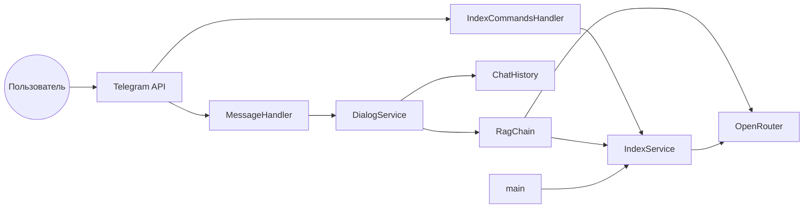

# Техническое видение проекта

Telegram-бот — **ассистент по продуктам Сбера** с **RAG** (retrieval-augmented generation).  
Идея продукта: [idea.md](idea.md).

Принципы: **KISS**, **YAGNI**, **ООП** (один публичный класс — один файл). Без оверинжиниринга.

Референс пайплайна: ноутбук **`naive-rag.ipynb`**, итоговая цепочка **`rag_query_transform_chain`** — ориентир по этапам (query transformation → retrieval → ответ), не обязательная копия построчно.

---

## 1. Технологии

### Язык и runtime

- **Python 3.12**

### Управление зависимостями

- **uv** — окружение и зависимости (`pyproject.toml`, `uv.lock`)

### Основные библиотеки

| Назначение | Технология |
|------------|------------|
| Telegram | **aiogram** 3.x, **long polling** |
| RAG и LLM | **LangChain** (`langchain`, `langchain-core`, `langchain-openai`, `langchain-text-splitters`) |
| PDF | **pypdf** |
| Провайдер | **OpenRouter** через `ChatOpenAI` / embeddings с `openai_api_base` = `OPENROUTER_BASE_URL` |
| Векторное хранилище | **`InMemoryVectorStore`** (LangChain) |
| Конфигурация | **pydantic-settings**, `.env` |
| Качество | **ruff** (lint/format), **pytest** (smoke критического пути) |

Модели, промпт, `RETRIEVER_K`, лимиты — **только из env** (`Settings`).

### Локальный запуск

- **Make** — `make install`, `make run`, `make lint`, `make test`
- **Docker** — опционально, тот же `.env`

### Сознательно не используем

FastAPI/отдельный HTTP-сервер, БД, брокеры, persistent vector DB, LangGraph, Poetry, retry/circuit breaker.

---

## 2. Принципы разработки

### KISS и YAGNI

Только сквозной сценарий: **индексация корпуса → диалог в Telegram → ответ по RAG**. Каждый новый класс/зависимость — с явной причиной.

### ООП

- Один публичный класс на файл; `snake_case.py` → `PascalCase`
- `main.py` — composition root без бизнес-логики

### Слои

```
handlers → DialogService → RagChain
                        ↘ IndexService
```

Handlers не вызывают LLM; LangChain-клиенты не знают про Telegram.

### Async

aiogram и LangChain (`ainvoke`) в едином async-стиле.

### История диалога

- В памяти процесса, per `chat_id`
- Формат — **сообщения LangChain**: `HumanMessage`, `AIMessage`, при необходимости `SystemMessage`
- Лимит — последние **N пар** user/assistant (`HISTORY_MAX_PAIRS`, default 10)

### Системный промпт

Ассистент **по продуктам и услугам Сбера** (кредиты, вклады, справка): отвечает в духе банковского консультанта, **опирается на контекст из документов**, не выдумывает тарифы/условия вне источников; при отсутствии фактов в контексте — честно сообщает об этом. Текст задаётся в `SYSTEM_PROMPT` (env).

---

## 3. Структура проекта

```
04-rag-langchain-2/
├── app/
│   ├── __init__.py
│   ├── main.py                      # DI, старт polling, переиндексация при старте
│   ├── config/
│   │   ├── settings.py              # Settings
│   │   └── logging_setup.py
│   ├── bot/
│   │   └── telegram_bot.py          # TelegramBot
│   ├── handlers/
│   │   ├── message_handler.py       # текст, /start
│   │   └── index_commands_handler.py  # /index, /index_status
│   ├── services/
│   │   ├── dialog_service.py        # DialogService
│   │   └── chat_history.py          # ChatHistory (BaseMessage)
│   └── rag/
│       ├── corpus_loader.py         # CorpusLoader
│       ├── index_service.py         # IndexService
│       └── rag_chain.py             # RagChain
├── data/
│   ├── ouk_potrebitelskiy_kredit_lph.pdf
│   ├── usl_r_vkladov.pdf
│   └── sberbank_help_documents.json
├── docs/
│   ├── idea.md
│   ├── vision.md
│   └── tasklist.md
├── tests/                           # pytest, Спринт 2
├── .env.example
├── Makefile
├── pyproject.toml
├── uv.lock
└── README.md
```

Опционально в корне: **`naive-rag.ipynb`** (эксперимент/референс; продакшн-логика — в `app/`).

### Назначение модулей

| Модуль | Класс | Ответственность |
|--------|--------|-----------------|
| `main.py` | — | Settings, wiring, `reindex()` при старте, polling |
| `corpus_loader.py` | `CorpusLoader` | Загрузка PDF + JSON из `DATA_DIR` |
| `index_service.py` | `IndexService` | Чанки, эмбеддинги, `InMemoryVectorStore`, `reindex()`, статус |
| `rag_chain.py` | `RagChain` | Query transform → retriever top-K → ответ LLM |
| `dialog_service.py` | `DialogService` | История + вызов `RagChain` |
| `chat_history.py` | `ChatHistory` | Буфер `BaseMessage` per `chat_id` |
| `index_commands_handler.py` | `IndexCommandsHandler` | `/index`, `/index_status` |

Модуль **`app/llm/openrouter_client.py`** (Спринт 1) **удаляется** в Спринте 2: вызовы LLM для RAG идут через LangChain `ChatOpenAI` в `RagChain` и эмбеддинги в `IndexService`. Отдельный «тонкий» openai-клиент не дублируем (YAGNI).

Заглушка **`context_provider.py`** — удаляется, заменена `RagChain`.

Модель **`chat_message.py`** — удаляется, история на LangChain messages.

---

## 4. Архитектура

### Общий подход

Один процесс, long polling, монолит.



### Поток текстового сообщения

1. Handler: `typing` → `DialogService.reply(chat_id, text)`.
2. Сохранить `HumanMessage` в `ChatHistory`.
3. `RagChain.answer(question, history, system_prompt)`:
   - **Query transformation**: LLM + история → поисковый запрос (как в `rag_query_transform_chain`).
   - **Retriever**: топ-**K** чанков, **K** = `RETRIEVER_K`.
   - **Финальный LLM**: системный промпт (роль консультанта Сбера) + история + user-сообщение с контекстом чанков.
4. Сохранить `AIMessage`, отправить ответ в Telegram.

### Индексация

- **При старте** (`main.py`): `await index_service.reindex()` — полная пересборка индекса из `data/`.
- **`/index`**: то же по запросу пользователя.
- **`/index_status`**: число чанков в текущем индексе (или сообщение, что индекс пуст).

Команды индекса **не сбрасывают** историю диалога.

### Composition root

`Settings` → `CorpusLoader`, `IndexService`, `RagChain`, `ChatHistory`, `DialogService` → handlers → `TelegramBot`.

Зависимости — через конструктор (manual DI в `main.py`).

### Ошибки

| Ситуация | Поведение |
|----------|-----------|
| Сбой LLM / сети | Короткое сообщение пользователю; детали в лог |
| Пустой индекс при вопросе | Сообщение, что база не готова; лог ERROR |
| Не текст | «Понимаю только текст» |
| Пустой текст | Подсказка написать вопрос |

Без retry и fallback-моделей.

---

## 5. Модель данных

### Постоянное хранилище

**Нет.** Индекс и история — **в RAM процесса**. Рестарт → переиндексация при старте, история обнуляется.

### Индекс

- `InMemoryVectorStore` + эмбеддинги через OpenRouter
- Сплиттер: разумный дефолт (`CHUNK_SIZE` / `CHUNK_OVERLAP` в env, default 1000 / 200)
- Статус: **число чанков** (`len` документов в store)

### История

- Ключ: `chat_id: int`
- Значение: `list[BaseMessage]` (`HumanMessage`, `AIMessage`)
- Обрезка: последние `HISTORY_MAX_PAIRS` пар

### Корпус (`data/`)

| Файл | Тип |
|------|-----|
| `ouk_potrebitelskiy_kredit_lph.pdf` | PDF |
| `usl_r_vkladov.pdf` | PDF |
| `sberbank_help_documents.json` | JSON (справка) |

---

## 6. Индексация и команды бота

- **`/index`**: полная переиндексация.
- **Старт бота**: полная переиндексация (как `/index`).
- **`/index_status`**: минимум **число чанков**; при ошибке/пустом — понятный текст.

Логи индексации: число документов/чанков, длительность; без содержимого чанков целиком.

---

## 7. RAG и работа с LLM

### Этапы (референс `rag_query_transform_chain`)

1. **Query transformation** — отдельный вызов LLM с системной инструкцией и историей; на выходе — одна строка поискового запроса (раскрытие местоимений, отсылки к прошлым репликам).
2. **Retrieval** — `as_retriever(search_kwargs={"k": RETRIEVER_K})`.
3. **Generation** — LLM с системным промптом (ассистент Сбера + правило опоры на контекст) и user-сообщением с отформатированными чанками.

### Модели

| Назначение | Env |
|------------|-----|
| Чат (transform + answer) | `LLM_MODEL` |
| Эмбеддинги | `EMBEDDING_MODEL` |

Один `OPENROUTER_API_KEY` и `OPENROUTER_BASE_URL` для обоих.

### Параметры

- `temperature=0` для RAG-вызовов (детерминированнее)
- Стриминг — не используем (одно сообщение в Telegram)
- Таймаут — `LLM_TIMEOUT_SEC` (default 60), если применимо к клиентам LangChain

### Логирование LLM

- Модель, число messages, длина ответа, факт transform-query (укороченно, не полный текст)
- Без API-ключей, без полных промптов и ответов

---

## 8. Сценарии работы

### Охват

Только **личные чаты** (`private`).

### Сценарии

| # | Триггер | Поведение |
|---|---------|-----------|
| 1 | Старт процесса | Переиндексация `data/` → polling |
| 2 | `/start` | Приветствие; история не сбрасывается |
| 3 | Текст | RAG-ответ с учётом истории |
| 4 | `/index` | Переиндексация |
| 5 | `/index_status` | Число чанков |
| 6 | Не текст | Отказ |
| 7 | Пустой текст | Подсказка |
| 8 | Ошибка API | Короткое сообщение + лог |
| 9 | Уточняющий вопрос | Query transform учитывает историю |
| 10 | Рестарт | Новый индекс при старте; история потеряна |

### Приветствие `/start`

Константа в handler: бот — помощник по **продуктам Сбера**, можно задавать вопросы по кредитам, вкладам и справке.

---

## 9. Конфигурирование

### Settings (`app/config/settings.py`)

Обязательные:

| Переменная | Описание |
|------------|----------|
| `TELEGRAM_BOT_TOKEN` | Токен бота |
| `OPENROUTER_API_KEY` | Ключ OpenRouter |
| `OPENROUTER_BASE_URL` | `https://openrouter.ai/api/v1` |
| `LLM_MODEL` | Модель чата |
| `EMBEDDING_MODEL` | Модель эмбеддингов |
| `SYSTEM_PROMPT` | Роль: ассистент по продуктам Сбера |
| `RETRIEVER_K` | Топ-K чанков (целое ≥ 1) |

Опциональные (дефолты в коде):

| Переменная | Default | Описание |
|------------|---------|----------|
| `HISTORY_MAX_PAIRS` | `10` | Лимит пар в истории |
| `LLM_TIMEOUT_SEC` | `60` | Таймаут |
| `LOG_LEVEL` | `INFO` | Логирование |
| `DATA_DIR` | `data` | Путь к корпусу |
| `CHUNK_SIZE` | `1000` | Размер чанка |
| `CHUNK_OVERLAP` | `200` | Перекрытие |
| `OPENROUTER_HTTP_REFERER` | — | Заголовок OpenRouter |
| `OPENROUTER_X_TITLE` | — | Заголовок OpenRouter |

Валидация при старте; пустые обязательные поля → выход с именем переменной.

### Пример `.env.example`

См. актуальный файл в корне репозитория (обновляется в итерации 11).

---

## 10. Логирование

- Стандартный **`logging`**, stdout, формат с timestamp
- INFO: старт, индексация (число чанков), входящие сообщения (`chat_id`, длина), вызовы RAG
- ERROR: сбои API/индексации, `exc_info` для неожиданных
- **Не логировать**: токены, ключи, полные тексты сообщений и чанков

---

## 11. Сборка, тесты и деплой

### Make

| Команда | Назначение |
|---------|------------|
| `make install` | `uv sync --dev` |
| `make run` | `uv run python -m app` |
| `make lint` | ruff check + format check |
| `make test` | `uv run pytest` |

### pytest (Спринт 2)

- Smoke: загрузка корпуса / подсчёт чанков (фикстуры или мок эмбеддингов)
- `RagChain`: query transform + retrieval с моком LLM/store при необходимости
- Не дублировать интеграционные тесты Telegram

### Docker

Как в Спринте 1: образ `python:3.12-slim`, `uv sync`, `CMD python -m app`, `env_file: .env`. В образ копировать `app/` и **`data/`**.

### README

Установка, `.env`, команды бота, положить файлы в `data/`, `make run`, Docker, systemd — по мере итераций Спринта 2.

---

## Эволюция (вне текущего scope)

Persistent vector store, `/reset`, групповые чаты, стриминг в Telegram, CI/CD — отдельными задачами после RAG-MVP.
