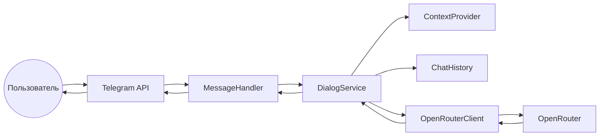

# Техническое видение проекта

Отправная точка для разработки LLM-ассистента в виде Telegram-бота.  
Идея продукта: [idea.md](idea.md).

Принципы: **KISS**, минимум абстракций, **ООП** (один класс — один файл). Без оверинжиниринга.

---

## 1. Технологии

### Язык и runtime

- **Python 3.12**

### Управление зависимостями

- **uv** — единственный инструмент для окружения и зависимостей
- `pyproject.toml` — метаданные проекта и список зависимостей
- `uv.lock` — зафиксированные версии (коммитится в репозиторий)
- Локально: `uv venv`, `uv sync` (dev-зависимости — с флагом `--dev` при необходимости)

### Основные библиотеки

| Назначение | Технология |
|------------|------------|
| Telegram Bot API | **aiogram** 3.x, запуск через **long polling** |
| LLM (OpenRouter) | официальный клиент **`openai`** (`AsyncOpenAI`), `base_url` и ключ — из конфигурации |
| Конфигурация | **pydantic-settings**, переменные из `.env` |
| Качество кода (dev) | **ruff** — lint и format |

Модель LLM, системный промпт и прочие параметры — **только из переменных окружения** (без хардкода в коде).

### Сборка (на этапе MVP)

- Отдельного артефакта (wheel/sdist) нет: «сборка» = установка зависимостей (`uv sync`) и запуск приложения
- При необходимости позже — `uv build`

### Локальный запуск и автоматизация

- **Make** — единая точка входа для команд без запоминания флагов uv/Docker
- **Docker** — опциональный локальный запуск в контейнере (тот же код, те же env)

### Тестирование

- **pytest** — запланирован на следующих этапах, не блокирует первый запуск бота

### Эволюция (не в MVP)

- **RAG** (retrieval-augmented generation) — планируется добавить позже; текущая архитектура не должна этому мешать, но реализацию RAG в MVP не включаем

### Сознательно не используем на старте

LangChain, отдельный HTTP-сервер (FastAPI и т.п.), БД, брокеры сообщений, Poetry/pip-tools.

---

## 2. Принципы разработки

### KISS

Реализуем только то, что нужно для диалога в Telegram и ответа LLM по роли из системного промпта. Каждая новая сущность (класс, модуль, зависимость) — с явной причиной.

### ООП: один класс — один файл

- Один публичный класс на файл; имя файла в `snake_case`, совпадает с назначением класса (например, `dialog_service.py` → класс `DialogService`)
- Без «god object» и смешения ответственностей в одном модуле
- Исключение: точка входа `main.py` без класса или с минимальной обвязкой запуска

### Слои и зависимости

Явные границы без лишних уровней:

```
Telegram (handlers) → сервис диалога → клиент LLM
```

Handlers не вызывают OpenAI напрямую; LLM-клиент не знает про Telegram.

### Async

Весь I/O — асинхронно: aiogram и `AsyncOpenAI` в едином async-стиле, без смешения sync/async в одном потоке обработки.

### Конфигурация

Секреты, модель, системный промпт и лимиты — только из переменных окружения (`.env` локально, env в Docker). В репозитории — `.env.example` без секретов.

### Состояние диалога (MVP)

- История сообщений — **в памяти процесса** (словарь по `chat_id`); при рестарте теряется — приемлемо для проверки идеи
- Обрезка истории — **последние N пар** user/assistant (N задаётся в env, по умолчанию 10), чтобы не раздувать контекст и стоимость запросов
- Один **системный промпт** на всё приложение из env; роли «на пользователя» — не в MVP (при необходимости расширим позже)

### Эволюция: RAG

Перед вызовом LLM зарезервирована точка расширения (отдельный класс/модуль подготовки контекста). Реализацию RAG не делаем в MVP, но не закладываем решения, которые помешают вставить retrieval между диалогом и LLM.

### Качество кода

- Перед коммитом: `make lint` (ruff)
- **pytest** — на следующих этапах, когда появятся стабильные сценарии для тестов

### Документация

Код, `vision.md`, `README` с командами Make — достаточно; отдельная wiki не нужна.

### Именование

| Сущность | Стиль |
|----------|--------|
| Файлы, модули | `snake_case` |
| Классы | `PascalCase` |
| Константы и настройки | через pydantic-settings, не «магические» строки в бизнес-логике |

---

## 3. Структура проекта

```
04-rag-langchain-2/
├── app/
│   ├── __init__.py
│   ├── main.py                  # точка входа: сборка зависимостей, запуск polling
│   ├── config/
│   │   ├── __init__.py
│   │   └── settings.py          # класс Settings
│   ├── bot/
│   │   ├── __init__.py
│   │   └── telegram_bot.py      # класс TelegramBot
│   ├── handlers/
│   │   ├── __init__.py
│   │   └── message_handler.py   # класс MessageHandler
│   ├── models/
│   │   ├── __init__.py
│   │   └── chat_message.py      # dataclass ChatMessage
│   ├── services/
│   │   ├── __init__.py
│   │   ├── dialog_service.py    # класс DialogService
│   │   └── chat_history.py      # класс ChatHistory
│   ├── llm/
│   │   ├── __init__.py
│   │   └── openrouter_client.py # класс OpenRouterClient
│   └── rag/
│       ├── __init__.py
│       └── context_provider.py  # класс ContextProvider (заглушка → RAG)
├── docs/
│   ├── idea.md
│   └── vision.md
├── .env.example
├── .gitignore
├── Dockerfile
├── docker-compose.yml
├── Makefile
├── pyproject.toml
├── uv.lock
└── README.md
```

### Назначение ключевых модулей

| Модуль | Класс | Ответственность |
|--------|--------|-----------------|
| `main.py` | — | Загрузка настроек, создание экземпляров, `start_polling` |
| `config/settings.py` | `Settings` | Чтение и валидация env |
| `bot/telegram_bot.py` | `TelegramBot` | `Bot`, `Dispatcher`, регистрация handlers |
| `handlers/message_handler.py` | `MessageHandler` | Текст, `/start`; делегирование в `DialogService` |
| `models/chat_message.py` | `ChatMessage` | Dataclass сообщения диалога (role, content) |
| `services/chat_history.py` | `ChatHistory` | Хранение и обрезка истории по `chat_id` в RAM |
| `services/dialog_service.py` | `DialogService` | Сборка messages для API, вызов LLM, сохранение ответа |
| `llm/openrouter_client.py` | `OpenRouterClient` | Запрос к OpenRouter через `AsyncOpenAI` |
| `rag/context_provider.py` | `ContextProvider` | Подготовка контекста перед LLM (MVP: заглушка) |

### Запуск

```bash
uv run python -m app
```

Команды обёрнуты в **Makefile** (`make run`, `make docker-run` и т.д.).

### Тесты

Каталог `tests/` добавим вместе с pytest; в структуру MVP не включаем.

---

## 4. Архитектура

### Общий подход

Монолитное приложение: **один процесс**, **long polling**, без отдельного HTTP-сервера и без микросервисов.



### Поток обработки сообщения

1. Пользователь отправляет **текст** → Telegram → aiogram → `MessageHandler`.
2. Handler показывает статус **«печатает…»** (`send_chat_action` с `typing`) на время ожидания LLM.
3. `MessageHandler` вызывает `DialogService.reply(chat_id, user_text)`.
4. `DialogService` сохраняет сообщение пользователя в `ChatHistory`, собирает список messages для API (system + история).
5. `ContextProvider.enrich(messages)` — **заглушка в MVP**: возвращает messages без изменений; позже — подмешивание контекста из RAG.
6. `OpenRouterClient.chat_completion(messages)` → OpenRouter.
7. Ответ assistant сохраняется в `ChatHistory`, возвращается в handler.
8. Handler отправляет текст ответа в чат.

### Composition root

Сборка зависимостей только в `main.py`:

`Settings` → `ChatHistory`, `OpenRouterClient`, `ContextProvider`, `DialogService` → `MessageHandler` → `TelegramBot`.

Зависимости передаются через **конструктор** (простой manual DI, без DI-фреймворков).

### Обработка ошибок (MVP)

| Ситуация | Поведение |
|----------|-----------|
| Ошибка LLM / сеть / таймаут | Сообщение пользователю: не удалось получить ответ; детали — в лог |
| Не текст (стикер, фото, …) | Ответ: поддерживается только текст |
| Падение процесса | История в RAM теряется (приемлемо для MVP) |

Без retry-очередей, circuit breaker и fallback-моделей на старте.

### ContextProvider и RAG

- **MVP:** класс-заглушка, не меняет messages.
- **Позже:** retrieval, вставка фрагментов в system или отдельное user-сообщение с контекстом; `DialogService` не переписываем — меняется только реализация `ContextProvider`.

### Масштабирование

Один инстанс = один polling. Горизонтальное масштабирование и webhook — вне scope MVP.

---

## 5. Модель данных

### Хранилище

**БД нет.** Состояние диалога — только **в памяти процесса** (`ChatHistory`). При рестарте история обнуляется.

### ChatMessage

Dataclass в `app/models/chat_message.py`:

| Поле | Тип | Значения |
|------|-----|----------|
| `role` | `Literal["user", "assistant"]` | Роль в диалоге (в хранилище; `system` не храним) |
| `content` | `str` | Текст сообщения |

Метод преобразования в формат OpenAI API: `to_api_dict() -> dict` с ключами `role`, `content`.

### ChatHistory

| Аспект | Описание |
|--------|----------|
| Ключ | `chat_id: int` (Telegram) |
| Значение | Список `ChatMessage` (только `user` и `assistant`) |
| System prompt | Не хранится; добавляется при сборке запроса из `Settings.system_prompt` |
| Лимит | Последние **N пар** диалога (user + assistant = одна пара). **N** — из env (`history_max_pairs`, по умолчанию **10**, т.е. до 20 сообщений в истории) |

### Сборка запроса к LLM

Порядок messages для API:

1. `{"role": "system", "content": system_prompt}` (+ позже дополнения от RAG через `ContextProvider`)
2. История чата (обрезанная)
3. Текущее сообщение пользователя (если ещё не добавлено в историю на момент сборки — по логике `DialogService`)

### Settings (конфигурация, не доменная БД)

| Поле (env) | Назначение |
|------------|------------|
| `TELEGRAM_BOT_TOKEN` | Токен бота |
| `OPENROUTER_API_KEY` | API-ключ OpenRouter |
| `OPENROUTER_BASE_URL` | Base URL (OpenRouter) |
| `LLM_MODEL` | Идентификатор модели |
| `SYSTEM_PROMPT` | Системный промпт / роль ассистента |
| `HISTORY_MAX_PAIRS` | Макс. пар user/assistant в истории (default: 10) |
| `LOG_LEVEL` | Уровень логирования |

### Пользователь

Отдельной сущности **User** нет — идентификатором служит `chat_id`. Профили и учётные записи — не в MVP.

### Команда /start

Приветственное сообщение (текст из кода или env), **историю не сбрасывает**.

### RAG (позже)

Модели документов, чанков и индекса появятся с реализацией RAG; в MVP не определяем.

---

## 6. Работа с LLM

### Провайдер и клиент

- Провайдер: **OpenRouter** (OpenAI-совместимый API)
- Библиотека: **`openai`** → `AsyncOpenAI`
- Параметры клиента из `Settings`: `openrouter_api_key`, `openrouter_base_url`
- Инкапсуляция в классе **`OpenRouterClient`** (`app/llm/openrouter_client.py`)

### Вызов API

- Метод: `chat.completions.create`
- Вход: `model` (из env), `messages` (список dict после сборки в `DialogService` + `ContextProvider`)
- Выход MVP: строка `choices[0].message.content`
- Пустой или отсутствующий content → исключение, обработка на уровне `DialogService` / handler

### Параметры генерации (MVP)

| Параметр | MVP |
|----------|-----|
| `temperature` | **Не передаём** — дефолт провайдера; при необходимости добавим в env позже |
| `max_tokens` | Не задаём — лимит модели/провайдера |
| Стриминг | **Выключен** — ждём полный ответ, одно сообщение в Telegram |

### Таймаут

- HTTP-таймаут запроса к API: **60 с** (значение из env, например `LLM_TIMEOUT_SEC`, default `60`)

### Заголовки OpenRouter (опционально)

Рекомендованные заголовки передаём через `default_headers` клиента, если заданы в env:

| Env | Заголовок |
|-----|-----------|
| `OPENROUTER_HTTP_REFERER` | `HTTP-Referer` |
| `OPENROUTER_X_TITLE` | `X-Title` |

Если переменная пуста — заголовок не отправляем.

### Цепочка вызова

```
DialogService
  → ContextProvider.enrich(messages)   # MVP: без изменений
  → OpenRouterClient.complete(messages) → str
```

### Ошибки и повторы

- Автоматический **retry** не делаем
- Исключения логируем (без ключей и без полного текста промпта/ответа)
- Пользователю — короткое сообщение об ошибке

### Логирование запросов

- Не логировать API-ключи и полные тексты сообщений
- Допустимо: `chat_id`, имя модели, длина/число messages, длина ответа, факт ошибки

### Эволюция

- `temperature`, `max_tokens` — через env при настройке поведения
- Стриминг в Telegram — отдельная задача, не в MVP
- RAG обогащает `messages` в `ContextProvider` до вызова `OpenRouterClient`

---

## 7. Сценарии работы

### Охват

- Только **личные чаты** (`private`). Сообщения из групп и каналов **игнорируем** (без ответа или с минимальным логом на debug).

### Сценарии MVP

| # | Триггер | Поведение |
|---|---------|-----------|
| 1 | `/start` | Короткое **приветствие** (кто бот, как пользоваться). История **не** сбрасывается |
| 2 | Текст | `send_chat_action(typing)` → LLM (system + история до 10 пар + текст) → ответ в чат; user/assistant сохраняются в `ChatHistory` |
| 3 | Не текст | «Сейчас я понимаю только текстовые сообщения» |
| 4 | Пустой текст | «Напишите ваш вопрос текстом» |
| 5 | Ошибка LLM / таймаут | «Не удалось получить ответ, попробуйте позже»; детали в лог |
| 6 | Длинный диалог | В API уходят только последние **10 пар**; старое отбрасывается |
| 7 | Рестарт бота | История в RAM пропадает; для пользователя — как новый диалог в памяти бота |

### Приветствие `/start`

- Текст — **константа в `MessageHandler`** (MVP, без лишнего env)
- При необходимости позже вынесем в `WELCOME_MESSAGE` в env

### Вне MVP

| Сценарий | Когда |
|----------|--------|
| `/help` | При появлении нескольких команд или RAG |
| `/reset` — сброс истории | По запросу, когда понадобится пользователям |
| Групповые чаты | Отдельная задача |
| Rate limit, модерация | После проверки идеи под нагрузкой |
| Мультиязычный UI | Не планируем на старте |

---

## 8. Подход к конфигурированию

### Инструмент

- **`pydantic-settings`**, один класс **`Settings`** в `app/config/settings.py`
- Загрузка при старте в `main.py`; один экземпляр передаётся в зависимости

### Источники

| Среда | Как |
|-------|-----|
| Локально (без Docker) | Файл **`.env`** в корне проекта + переменные окружения ОС (env имеет приоритет над файлом — стандартное поведение pydantic) |
| Docker | Тот же **`.env`** через `env_file` в `docker run` / Compose |

**Один `.env` на все способы запуска** — отдельный `.env.docker` не используем.

### Репозиторий

- `.env` — в **`.gitignore`**, секреты не коммитим
- **`.env.example`** — в репозитории: все ключи с пустыми или примерными значениями, без реальных токенов

### Обязательные переменные

| Переменная | Описание |
|------------|----------|
| `TELEGRAM_BOT_TOKEN` | Токен Telegram-бота |
| `OPENROUTER_API_KEY` | API-ключ OpenRouter |
| `LLM_MODEL` | Идентификатор модели |
| `SYSTEM_PROMPT` | Системный промпт (роль ассистента) |

### Опциональные (дефолты в `Settings`)

| Переменная | Default | Описание |
|------------|---------|----------|
| `OPENROUTER_BASE_URL` | `https://openrouter.ai/api/v1` | Base URL API (в `.env` можно не указывать) |
| `HISTORY_MAX_PAIRS` | `10` | Лимит пар в истории |
| `LLM_TIMEOUT_SEC` | `60` | Таймаут запроса к LLM |
| `LOG_LEVEL` | `INFO` | Уровень логирования |
| `OPENROUTER_HTTP_REFERER` | — | Заголовок OpenRouter (не задан → не отправляем) |
| `OPENROUTER_X_TITLE` | — | Заголовок OpenRouter (не задан → не отправляем) |

Текст приветствия `/start` — **не в env** (константа в коде, см. раздел 7).

### Валидация

- При старте: если обязательное поле пустое → ошибка с именем переменной, процесс завершается
- Типы и диапазоны (например, `history_max_pairs > 0`) проверяет pydantic

### Пример `.env.example`

```env
TELEGRAM_BOT_TOKEN=
OPENROUTER_API_KEY=
LLM_MODEL=
SYSTEM_PROMPT=

# OPENROUTER_BASE_URL=https://openrouter.ai/api/v1
# HISTORY_MAX_PAIRS=10
# LLM_TIMEOUT_SEC=60
# LOG_LEVEL=INFO
# OPENROUTER_HTTP_REFERER=
# OPENROUTER_X_TITLE=
```

---

## 9. Подход к логгированию

### Инструмент

- Стандартная библиотека **`logging`**
- Без structlog, loguru и внешних агрегаторов на этапе MVP

### Инициализация

- Функция **`setup_logging(level: str)`** вызывается один раз в `main.py` до запуска бота
- Уровень из `Settings.log_level` (`LOG_LEVEL`, default `INFO`)
- Для отладки локально: **`LOG_LEVEL=DEBUG`** — отдельный «dev-режим» не нужен

### Формат и вывод

```
%(asctime)s [%(levelname)s] %(name)s: %(message)s
```

- Поток: **stdout** (совместимо с Docker и `docker logs`)
- Логгеры по имени модуля: `app.handlers.message_handler`, `app.llm.openrouter_client`, …

### Что логируем

| Событие | Уровень | Данные |
|---------|---------|--------|
| Старт / остановка приложения | INFO | — |
| Входящее сообщение | INFO | `chat_id`, длина текста |
| Запрос к LLM | INFO | модель, число messages |
| Успешный ответ LLM | INFO | длина ответа |
| Игнор non-private / non-text | DEBUG | `chat_id`, тип контента |
| Ошибка LLM / сеть | ERROR | тип/код ошибки API, **без** тела ответа; `exc_info` для неожиданных исключений |

### Что не логируем

- `TELEGRAM_BOT_TOKEN`, `OPENROUTER_API_KEY`
- Полный `SYSTEM_PROMPT` и полные тексты сообщений пользователя и ассистента

### Эволюция

- JSON-логи, correlation id, экспорт в Loki/CloudWatch — при необходимости после MVP

---

## 10. Сборка и деплой

### Локальная разработка (без Docker)

| Команда | Назначение |
|---------|------------|
| `make install` | `uv sync --dev` — зависимости + ruff |
| `make run` | `uv run python -m app` |
| `make lint` | `uv run ruff check .` и `ruff format --check .` |
| `make format` | `uv run ruff format .` |

Перед первым запуском: скопировать `.env.example` → `.env`, заполнить секреты.

### Docker

| Команда | Назначение |
|---------|------------|
| `make docker-build` | Сборка образа `telegram-llm-bot` |
| `make docker-run` | `docker run --rm --env-file .env telegram-llm-bot` |
| `make up` | `docker compose up -d` (сборка при необходимости) |
| `make down` | `docker compose down` |

#### Dockerfile (MVP)

- Базовый образ: **`python:3.12-slim`**
- Установка **uv**, копирование `pyproject.toml` + `uv.lock`
- `uv sync --frozen --no-dev`
- Копирование `app/`
- `CMD ["python", "-m", "app"]`
- Multi-stage не используем

#### docker-compose.yml

Один сервис **`bot`**:

- `build: .`
- `image: telegram-llm-bot`
- `env_file: .env`
- `restart: unless-stopped`
- без проброса портов (polling не слушает входящие HTTP)

### Деплой (MVP)

- **Локально / VPS:** `make up` или `make run` под **systemd** (см. README)
- CI/CD, Kubernetes, Telegram **webhook** — вне scope MVP
- Облачный хостинг — любой VPS с Docker; vision не привязывает к платформе

### README: пример systemd

В **README.md** — готовый пример unit-файла `/etc/systemd/system/telegram-llm-bot.service`:

- `WorkingDirectory` — путь к проекту на сервере
- `ExecStart` — `/usr/bin/docker compose up` или `docker compose -f ... up` из каталога проекта  
  *(альтернатива без compose: `docker run --env-file .env telegram-llm-bot`)*
- `Restart=always`
- `After=docker.service`
- команды: `systemctl enable --now telegram-llm-bot`, `journalctl -u telegram-llm-bot -f`

Отдельный файл unit в репозиторий не кладём — только документация в README.

### .gitignore (минимум)

```
.env
.venv/
__pycache__/
*.pyc
.ruff_cache/
.pytest_cache/
```

### Эволюция

- CI (lint + тесты), публикация образа в registry
- Healthcheck, метрики, blue-green — по мере роста проекта
